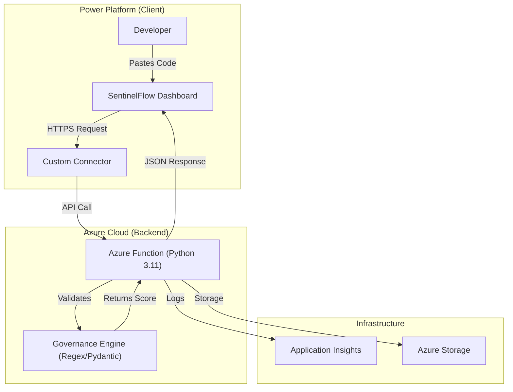

# SentinelFlow: Automated Power Platform Governance Engine


**SentinelFlow** is a hybrid governance engine that bridges the gap between **Low-Code** velocity and **Pro-Code** security standards. It allows Citizen Developers to audit their Power Apps code in real-time against enterprise security policies (GDPR, Credential Leaks, Performance) using a serverless Azure backend.

---

## Architecture

The solution implements a **Hybrid Fusion Development** architecture:



## Key Features

* **Real-Time Static Analysis:** Scans PowerFx code for hardcoded secrets (API keys, passwords) and PII (Social Security Numbers).
* **Performance Auditing:** Detects heavy operations like unfiltered `ClearCollect`.
* **Hybrid Integration:** Seamlessly connects a Canvas App UI to a Python backend via OpenAPI (Swagger).
* **Infrastructure as Code:** Fully deployable via Azure Bicep for reproducible environments.
* **Strict Typing:** Powered by Pydantic to ensure a rigid API contract.

---

## Project Structure

```text
SentinelFlow/
├── backend/                  # Azure Function (Python 3.11)
│   ├── governance_engine/    # Core Logic (Rules & Models)
│   ├── function_app.py       # API Entry Point
│   └── requirements.txt      # Python Dependencies
├── infra/                    # Infrastructure as Code
│   └── main.bicep            # Azure Resource Definitions
├── integration/              # API Contract
│   └── sentinel_openapi.json # Swagger Definition for Power Platform
├── docs/                     # Documentation & Diagrams
├── tests/                    # Unit Tests (Pytest)
├── Makefile                  # Automation Scripts
└── README.md                 # Project Documentation

```

---

## Deployment Guide

This project uses a `Makefile` to automate the entire lifecycle.

### Prerequisites

* **Azure CLI** (`az login` must be run beforehand)
* **Python 3.11+**
* **Azure Functions Core Tools** (for local debugging)
* **Power Apps Developer Plan**

### 1. Setup Local Environment

Creates a virtual environment and installs Python dependencies.

```bash
make setup

```

### 2. Provision Infrastructure

Deploys the Azure Resources (Function App, Storage, App Insights) using Bicep.

```bash
make infra-create

```

### 3. Deploy Backend Code

Publishes the Python logic to the newly created Azure Function.

```bash
make deploy-code

```

*(Optional) To deploy both infrastructure and code in one go:*

```bash
make deploy-all

```

---

## Connecting Power Apps

Once the backend is live, you must connect the UI:

1. **Get the API URL:**
Run `make get-url` to retrieve your deployed endpoint.

2. **Update OpenAPI Definition:**
Open `integration/sentinel_openapi.json` and replace the `"host"` value with your Azure Function domain.

3. **Import Custom Connector:**
   * Go to [make.powerapps.com](https://www.google.com/search?q=https://make.powerapps.com)
   * **Custom Connectors** > **New** > **Import from OpenAPI file**.
   * Select `integration/sentinel_openapi.json`.

4. **Create Canvas App:**
   * Create a new Blank Canvas App.
   * Add the `SentinelFlowConnector` as a data source.
   * Build the UI to accept text input and call `SentinelFlowConnector.AuditApp()`.

## Build the UI

Create a Blank Canvas App and add the **SentinelFlowConnector** as a data source. Add the following controls:

#### **A. Input Section**

* **Control:** Text Input
* **Name:** `txtCodeInput`
* **Mode:** `Multiline`
* **HintText:** `"Paste Power App Source Code (JSON) here..."`

#### **B. The "Audit" Button**

* **Control:** Button
* **Text:** `"Audit App"`
* **OnSelect Property:**
```powerfx
// 1. Show loading state
UpdateContext({ locIsLoading: true });

// 2. Call Azure Function (Pass plain strings, not a record)
UpdateContext({ 
    locScanResult: SentinelFlowGovernanceAPI.AuditApp(
        "UserScan", 
        txtCodeInput.Text
    ) 
});

// 3. Hide loading
UpdateContext({ locIsLoading: false });

```

#### **C. The Score Display**

* **Control:** Label
* **Text Property:**
```powerfx
"Governance Score: " & locScanResult.governance_score & "/100"

```

* **Color Property:** (Dynamic Red/Green logic)
```powerfx
If(locScanResult.governance_score < 70, Color.Red, Color.Green)

```

#### **D. The Findings Gallery**

* **Control:** Vertical Gallery
* **Items Property:** `locScanResult.findings`
* **Inside the Gallery:**
* **Title Label:** `ThisItem.rule_id & " | " & ThisItem.severity`
* *Color:* `If(ThisItem.severity = "Critical", Color.Red, Color.Black)`


* **Subtitle Label:** `ThisItem.message`

---

## Demo Scenarios

Use these code snippets to demonstrate the engine's capabilities during a live demo.

### 🟢 Scenario 1: The "Perfect" App

**Goal:** Prove the engine recognizes good code patterns.
**Input:**

```javascript
// A perfectly compliant app
Set(varCurrentUser, User().FullName);
Set(locIsVisible, true);
Set(colMenu, ["Home", "Settings"]);

```

**Expected Result:**

* **Score:** 100/100 (Green)
* **Findings:** None (Empty Gallery)

### 🔴 Scenario 2: The "GDPR Nightmare"

**Goal:** Trigger a Critical Privacy Rule (`PRIV-001`).
**Input:**

```javascript
// Asking for sensitive info
Set(varEmployeeSSN, "123-45-6789");
Label1.Text = "Please enter your Social Security Number";

```

**Expected Result:**

* **Score:** < 80/100 (Red)
* **Findings:**
* `PRIV-001 | Critical` (Red) - "Potential PII exposure..."

### 🟠 Scenario 3: The "Sloppy Developer"

**Goal:** Trigger Warnings (`GOV-001`) and Info (`PERF-001`) without failing security checks.
**Input:**

```javascript
// Bad naming conventions (No 'var' prefix)
Set(userCount, 50); 
Set(tempData, "test");

// Performance risk
ClearCollect(bigList, SharePoint_Data);

```

**Expected Result:**

* **Score:** ~88/100 (Yellow/Orange)
* **Findings:**
* `GOV-001 | Warning` (Orange) - "Variable does not follow naming..."
* `PERF-001 | Info` (Black) - "Heavy operation detected..."

---

## Teardown

To avoid incurring cloud costs, destroy all resources when finished.

```bash
make destroy

```

*Warning: This permanently deletes the 'SentinelFlow-RG' resource group.*

---